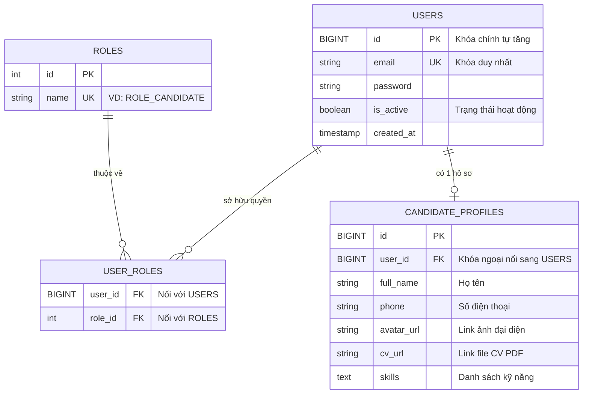

# 🗄️ Thiết Kế Cơ Sở Dữ Liệu: JobRadar (Phase 1)

*Tài liệu này lưu trữ thiết kế Database (ERD) và giải thích chi tiết mục đích của từng bảng / thuộc tính. Phục vụ cho việc code Entity trong Spring Boot và ôn tập phỏng vấn.*

---

## 1. Sơ đồ ERD (Entity-Relationship Diagram)

Sơ đồ thể hiện mối quan hệ cho phân hệ **Quản lý Tài khoản (Auth)** và **Hồ sơ Ứng viên (Candidate Portal)**.

---

## 2. Giải thích chi tiết các Entity (Thực thể)

### 2.1. Entity: `USERS` (Quản lý Xác thực / Đăng nhập)
Bảng này chỉ chịu trách nhiệm duy nhất là kiểm tra xem *người đó là ai* và *có được phép vào hệ thống hay không*.

*   **`id` (BIGINT / Khóa chính):** Mã định danh duy nhất của người dùng. Tự động tăng (Auto-increment).

*   **`email` (VARCHAR):** Đóng vai trò là Tên đăng nhập (Username). Cột này bắt buộc phải cấu hình ràng buộc **Unique (Duy nhất)** để chống việc 2 người cùng đăng ký 1 email.

*   **`password` (VARCHAR):** Lưu mật khẩu của người dùng. 

    *   *Lưu ý phỏng vấn:* Tuyệt đối không lưu chữ thô (plaintext). Phải băm (hash) bằng thuật toán **BCrypt** trước khi lưu xuống DB.

*   **`is_active` (BOOLEAN):** Trạng thái tài khoản (True/False). 

    *   *Mục đích:* Dùng để "Khóa mõm" user vi phạm bằng cách đổi thành `False`, thay vì dùng lệnh `DELETE` làm mất dữ liệu lịch sử. (Kỹ thuật Soft Delete).

*   **`created_at` (TIMESTAMP):** Thời gian tạo tài khoản. Giúp xuất báo cáo thống kê.

### 2.2. Entity: `ROLES` (Quản lý Quyền hạn)
Bảng chứa dữ liệu tĩnh. Thường chỉ insert tay vài dòng khởi tạo.

*   **`id` (INT / Khóa chính):** Mã quyền (VD: 1, 2, 3).

*   **`name` (VARCHAR):** Tên quyền. 

    *   *Lưu ý code:* Phải đặt theo chuẩn có chữ `ROLE_` ở đầu (VD: `ROLE_CANDIDATE`, `ROLE_ADMIN`) để thư viện bảo mật **Spring Security** tự động nhận diện phân quyền.

### 2.3. Entity: `USER_ROLES` (Bảng trung gian)
Giải quyết bài toán quan hệ Nhiều-Nhiều (1 User có nhiều quyền, 1 quyền có nhiều User).

*   **`user_id` (BIGINT / Khóa ngoại):** Trỏ tới cột `id` của bảng `USERS`.

*   **`role_id` (INT / Khóa ngoại):** Trỏ tới cột `id` của bảng `ROLES`.

### 2.4. Entity: `CANDIDATE_PROFILES` (Hồ sơ Ứng viên)
Chứa thông tin chi tiết hiển thị lên giao diện. Tách rời khỏi bảng USERS theo chuẩn hóa (Normalization) để tránh dữ liệu rỗng (Null) khi user là Admin hoặc Employer.

*   **`id` (BIGINT / Khóa chính):** Mã định danh hồ sơ.

*   **`user_id` (BIGINT / Khóa ngoại):** Trỏ về `USERS`. Quan hệ **1-1** (Mỗi ứng viên có 1 Profile).

*   **`full_name` (VARCHAR):** Tên đầy đủ ứng viên.

*   **`phone` (VARCHAR):** Số điện thoại liên hệ.

*   **`avatar_url` (VARCHAR):** Đường dẫn link ảnh đại diện.

    *   *Kiến thức thực tế:* Ảnh thực tế lưu trên Cloud (S3/Cloudinary), DB chỉ lưu chuỗi đường dẫn text. Không lưu trực tiếp file vào DB.

*   **`cv_url` (VARCHAR):** Đường dẫn tới file PDF CV gốc.

*   **`skills` (TEXT hoặc JSONB):** Lưu danh sách kỹ năng (Java, Spring, React...). 

    *   *Điểm sáng CV:* Dùng kiểu `JSONB` của PostgreSQL giúp truy vấn tìm kiếm ứng viên theo thẻ tag cực kỳ nhanh.

---

## 3. Các Phân hệ Tiếp theo (Sẽ mở rộng sau)
Theo phương pháp phát triển linh hoạt (Agile / Cuốn chiếu), chúng ta sẽ không thiết kế toàn bộ 100% database ngay từ đầu để tránh bị ngợp và rủi ro sửa đổi. Dưới đây là bức tranh tổng quan cho các bảng sẽ được thêm vào ở các chặng tiếp theo:

### 3.1. Phân hệ Việc Làm & Công ty (Job & Company Portal)
*   **`COMPANIES` (Công ty):** `id`, `name`, `description`, `logo_url`, `website`, `is_verified`.

*   **`JOBS` (Tin tuyển dụng):** `id`, `company_id` (FK nối với bảng COMPANIES), `title`, `description`, `salary_min`, `salary_max`, `location`, `status` (OPEN/CLOSED).

### 3.2. Phân hệ Ứng tuyển & Theo dõi (Application Tracker)
*   **`JOB_APPLICATIONS` (Đơn ứng tuyển):** `id`, `job_id` (FK), `candidate_id` (FK nối với CANDIDATE_PROFILES), `status` (PENDING, REVIEWING, INTERVIEW, REJECTED), `applied_at`.

*   **`COMPANY_REVIEWS` (Đánh giá công ty):** `id`, `company_id` (FK), `candidate_id` (FK), `rating` (1-5 sao), `review_text`.
